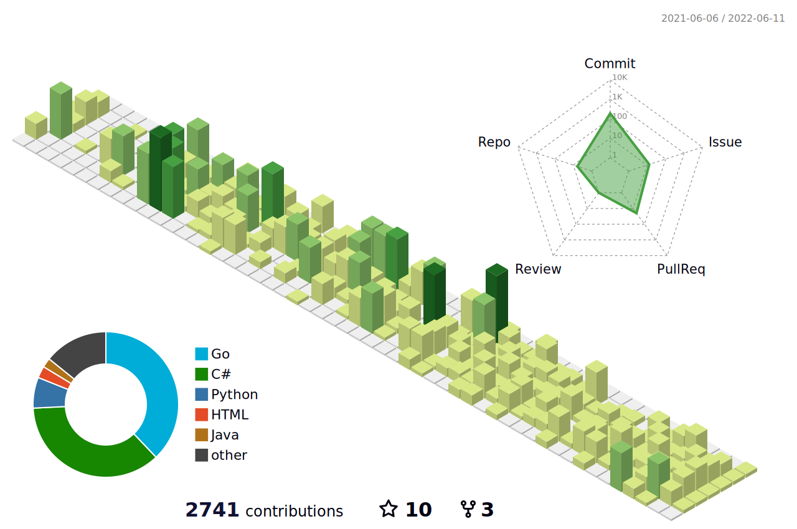

# Hi there 👋

🔭 I'm Denis, a product engineer, and sport enthusiast

## 🤔 My active open-source projects

- [Testhub.io](https://github.com/testhub-io/testhub)
- [Go Config Manager](https://github.com/num30/config)
- [Go Generic Cache](https://github.com/num30/go-cache)

## 😞 Not so active projects:
  - Debug Time Search Visual Studio extension https://github.com/DenisPalnitsky/DebugTimeSearch
  - Automock Visual Studio extension https://github.com/DenisPalnitsky/automock 

## 📱 Profiles 
- [Linkedin](https://www.linkedin.com/in/denis-palnitsky/) 
- [CV](http://denispalnitsky.com/)
- [Twitter](https://twitter.com/Number30)
-  

## :mortar_board: Engineering Principles
[PRINCIPLES.md](https://github.com/DenisPalnitsky/DenisPalnitsky/blob/main/PRINCIPLES.md)

## 😎 Cool Thing

